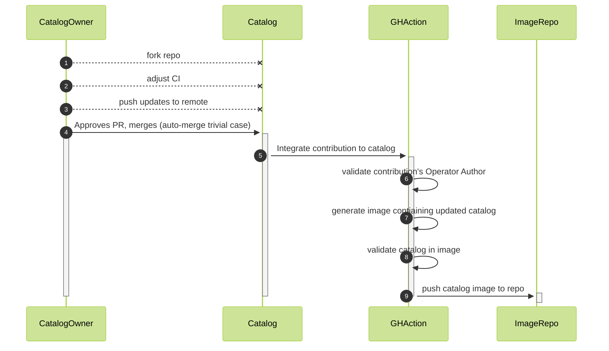

# CoolCatalog
Welcome!  This repository showcases example workflows for building OLM Catalogs via Declarative Configurations

## Quickstart
1. fork this repository
2. determine the desired storage format of the resulting FBC catalog hierarchy (unversioned per-operator partitions?  nested versions? etc.)
3. add/modify/adjust action configurations in `.github/workflows`
4. communicate your desired storage format to contributors
5. push changes


## Detailed HOWTO

### Actors and Terms
- [`File-Based Catalog`](https://olm.operatorframework.io/docs/reference/file-based-catalogs/) (FBC) is the declarative expression of operators and their relationships with other operators, other versions of themselves.
- [`Veneers`](https://olm.operatorframework.io/docs/reference/veneers/) are a general class of objects which can provide a simplified interaction with FBC.
- `Operator Author` is the role related to expressing an individual operator versions, channels, properties, etc. in a destination catalog.
- `Catalog` is the FBC-based catalog composed of the FBC contributions of one or more operators.
- `Catalog Owner` is the role related to integrating Operator Authors' catalog contributions.
- `Catalog Contribution` is the FBC that a Catalog Ownder receives from an Operator Author.  The format needs to be negotiated with the Operator Author.
For this example, the Catalog Owner receives contributions of a single, unversioned directory named after the operator which contain all FBC files, e.g.:

```tree
catalog
└── testoperator
    ├── .indexignore
    ├── OWNERS
    └── catalog.yaml
```

### Lifecycle

This repository models a FBC catalog which receives contributions from one or more Operator Authors, merges and organizes those contributions. This repository has pre-configured GitHub actions to validate contributing authors, validate FBC contributions, auto-merge contribution PRs, and push updated catalog images capable of serving as [Catalog Sources](https://olm.operatorframework.io/docs/concepts/crds/catalogsource/).




1. Fork and Clone Remote Repository  
IMPORTANT! Failure to customize could result in unwanted contributions.

2. Determine Storage Strategy and Adjust CI
The default configuration for this repository is a collection of operator-titled directories which individually and collectively validate successfully via `opm validate`. The storage strategy must be communicated to any contributing Operator Authors.
Customize CI workflows in `.github/workflows/` to suit your authorization, validation, organization, and publication needs.

3. Push Changes to Remote
Once finishing customization, push changes to the remote repo to ready it to receive contributions.

4. Catalog Contribution Approval
The default configuration of this repo will auto-approve an Operator Author's contribution if:

    1. the Operator Author is listed in the CODEOWNERS file
    2. the Catalog Contribution passes validation.  This is currently just `opm validate`.
    3. the Catalog Contribution cam be automerged without conflict.  

5. Catalog Publication  
Once a PR merges, a GitHub action will be triggered to build and push a Docker catalog image.

