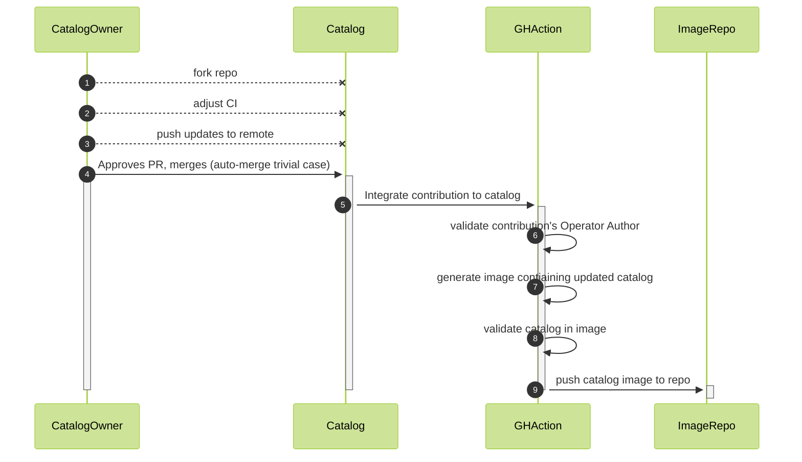

# CoolCatalog
Welcome!  This repository showcases example workflows for building OLM Catalogs via Declarative Configurations

## Quickstart
1. fork this repository
2. determine the desired storage format of the resulting FBC catalog hierarchy (unversioned per-operator partitions?  nested versions? etc.)
3. add/modify/adjust action CI configurations in [.github/workflows](.github/workflows)
4. communicate your desired storage format to contributors
5. push changes


## Detailed HOWTO

### Actors and Terms
- [`File-Based Catalog`](https://olm.operatorframework.io/docs/reference/file-based-catalogs/) (FBC) is the declarative expression of operators and their relationships with other operators, other versions of themselves.
- [`Veneers`](https://olm.operatorframework.io/docs/reference/veneers/) are a general class of objects which can provide a simplified interaction with FBC.
- `Operator Author` is the role related to expressing an individual operator versions, channels, properties, etc. in a destination catalog.
- `Catalog` is the FBC-based catalog composed of the FBC contributions of one or more operators.
- `Catalog Owner` is the role related to integrating Operator Authors' catalog contributions.
- `Catalog Contribution` is the FBC that a Catalog Ownder receives from an Operator Author.  The format needs to be negotiated with the Operator Author.
For this example, the Catalog Owner receives contributions of a single, unversioned directory named after the operator which contain all FBC files, e.g.:

```tree
catalog
├── .indexignore          (to make `opm validate` ignore README.md)
├── README.md
├── testoperator
│   ├── .indexignore
│   ├── OWNERS
│   └── catalog.yaml
└── testoperator2
    ├── .indexignore
    ├── OWNERS
    └── catalog.yaml
```

### Lifecycle

This repository models an operator catalog which receives contributions from one or more Operator Authors, merges and organizes those contributions. This repository has pre-configured GitHub actions to validate contributed content, validate FBC contributions, auto-merge contribution PRs, and push updated catalog images capable of serving as [Catalog Sources](https://olm.operatorframework.io/docs/concepts/crds/catalogsource/).




1. Fork and Clone Remote Repository  
IMPORTANT! Failure to customize could result in unwanted contributions.

2. Determine Storage Strategy and Adjust CI
The default configuration for this repository is a collection of operator-titled directories which individually and collectively validate successfully via [`opm validate`](https://olm.operatorframework.io/docs/reference/file-based-catalogs/#opm-validate). The storage strategy must be communicated to any contributing Operator Authors.

3. Customize CI workflows in [.github/workflows](.github/workflows) to suit your authorization, validation, organization, and publication needs.  At a minimum, to suit the "as-is" for this repository, you must:
    1. define a [Personal Access Token](https://docs.github.com/en/authentication/keeping-your-account-and-data-secure/creating-a-personal-access-token) (PAT) `GH_PAT` for the [auto-merge action](https://github.com/marketplace/actions/enable-pull-request-automerge)

    2. Set branch protection rules for the fork:
        1. `Settings -->  Branches`  add a new rule
        2. Set the following fields:
            - `Require a pull request before merging`
            - `Require status checks to pass before merging`
            - `Require branches to be up to date before merging`
        3. Set `Status Checks that are required` by searching for `build` and selecting it from the search results. (Note:  you may have to attempt a submission action before this will be available.)

    3. Set general settings for the fork (`Settings --> General`):
        1. `Allow merge commits`
        2. `Allow squash merging`
        3. `Allow auto-merge`
        4. (optional) `Automatically delete head branches`

    4. (if you wish to push images to other than docker's image repository)
        1. add a `repository` field to the docker/login-action, for e.g. quay.io:
        ```
        - name: login to registry
          uses: docker/login-action@v1
          with:
            registry: "quay.io"
            username: ${{ secrets.DOCKER_USERNAME }}
            password: ${{ secrets.DOCKER_PASSWORD }}
        ```

        2. add a corresponding `images` field to the docker/metadata-action (e.g. quay.io/exampleuser/cool-catalog)

        ```
        - name: Docker meta
          id: docker_meta
          uses: docker/metadata-action@v3
          with:
            images: quay.io/exampleuser/cool-catalog
            tags: ${{ github.event.number }}
        ```

4. Push Changes to Remote
Once finishing customization, push changes to the remote repo to ready it to receive contributions.

5. Catalog Contribution Approval
The default configuration of this repo will auto-approve an Operator Author's contribution if:

    1. the Operator Author is listed in the CODEOWNERS file
    2. the Catalog Contribution passes validation.  This is currently just `opm validate`.
    3. the Catalog Contribution can be automerged without conflict.

6. Catalog Publication
Once a PR merges, a GitHub action will be triggered to build and push a Docker catalog image.

